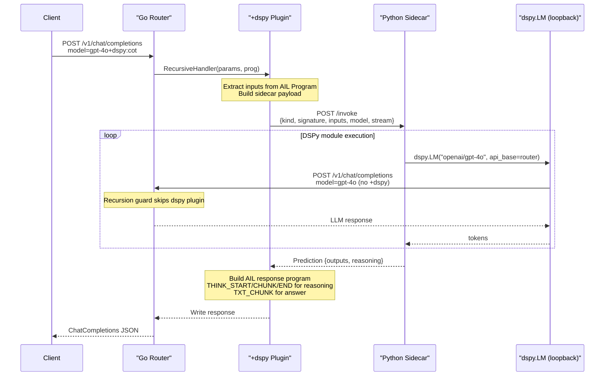
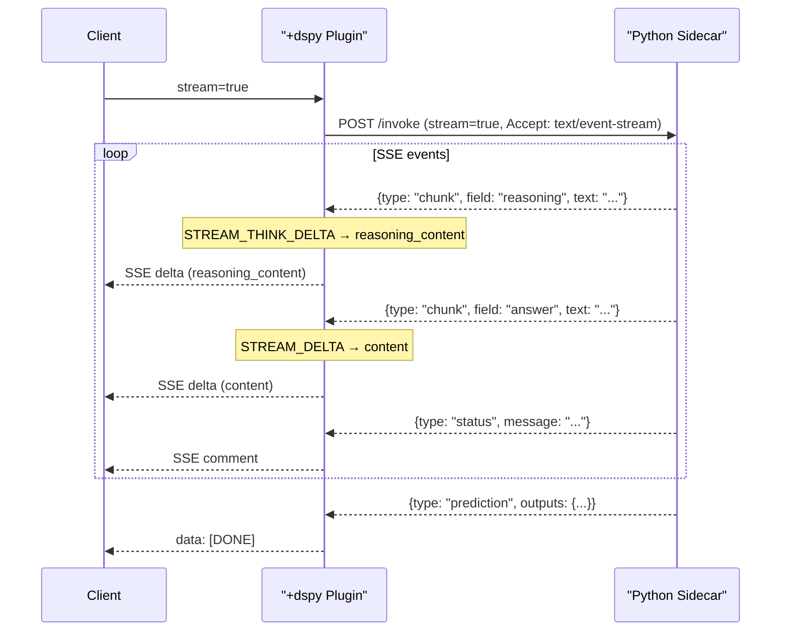

# DSPy Bridge Plugin — Architecture

## Overview

The `+dspy` plugin bridges the Open AI Router to [DSPy](https://dspy.ai), enabling
DSPy modules (ChainOfThought, ReAct, Predict, RLM) to run as transparent
inference plugins.

```
Client  ──POST /v1/chat/completions──►  Router  ──POST /invoke──►  Sidecar (Python)
                                         ▲                            │
                                         │   loopback LM calls        │
                                         └────────────────────────────┘
```

The sidecar configures `dspy.LM(api_base=router_url)` so every LM call DSPy makes
routes back through the router — **minus the `+dspy` suffix** — enabling full
provider fallback, logging, and all other plugins on the inner calls.

## Data Flow



### Streaming Variant



## Plugin Syntax

```
model+dspy                                    → kind=cot, sig="history, question -> answer"
model+dspy:predict                            → Predict module
model+dspy:cot                                → ChainOfThought module
model+dspy:react                              → ReAct agent (with tool use)
model+dspy:rlm                                → Recursive Language Model
model+dspy:cot:context,%20question%20->%20answer  → custom signature (URL-encoded)
```

## Input Mapping

The Go plugin extracts inputs from the AIL program based on the signature's input fields:

| Signature Field | AIL Source |
|----------------|------------|
| `history` | All messages → `[{role, content}, ...]` (JSON) |
| `context` | `SystemPrompt()` |
| `question` | `LastUserMessage()` → `MessageText()` |
| (other) | Falls back to `LastUserMessage()` |

## Output Mapping

| Sidecar Output | AIL Opcode | OpenAI Field |
|---------------|-----------|-------------|
| `reasoning` / `rationale` | `THINK_START` + `THINK_CHUNK` + `THINK_END` | `reasoning_content` |
| `answer` (or other output fields) | `TXT_CHUNK` | `content` |
| tool calls (ReAct) | `CALL_START` + `CALL_NAME` + `CALL_ARGS` + `CALL_END` | `tool_calls` |

## Recursion Guard

The plugin sets a `dspyRecursionGuard{}` context key before the first call.
When the sidecar's LM calls loop back through the router, the guard prevents
the `+dspy` plugin from triggering again — the request falls through to
the normal inference pipeline.

## Configuration

| Environment Variable | Default | Description |
|---------------------|---------|-------------|
| `DSPY_SIDECAR_URL` | `http://localhost:8780` | Sidecar base URL |
| `DSPY_TIMEOUT` | `120s` | HTTP timeout for sidecar calls |
| `ROUTER_BASE_URL` | `http://localhost:3000` | Router URL (sidecar config) |
| `DSPY_SIDECAR_PORT` | `8780` | Sidecar listen port |
| `DSPY_DEFAULT_LM` | `gpt-4o-mini` | Fallback model name |

## File Layout

```
src/plugins/dspy/
  dspy.go          Go RecursiveHandlerPlugin
  dspy_test.go     Unit tests (param parsing, signature parsing)
sidecar/
  dspy_sidecar.py  FastAPI sidecar (DSPy execution)
  requirements.txt Python dependencies
```

## Extensibility

The architecture is designed for future extension:

- **New kinds**: Add to `validKinds` map in Go + `build_module()` in Python
- **Optimized programs**: The sidecar's `/invoke` endpoint could accept an
  additional `program_path` field to load compiled DSPy programs
- **Custom tools**: ReAct tool stubs can be replaced with real implementations
  that call external APIs directly from the sidecar
