# Virtual Model → Anthropic claude-opus-4-6 — Non-Streaming

Request arrives as `model=custom_provider/custom_model`, virtual mapping resolves it to
`anthropic/claude-opus-4-6`, request is forwarded to the real Anthropic API in Anthropic
Messages format and the response is converted back to OpenAI Chat Completions JSON.

```mermaid
flowchart TB
    CLIENT["Client
    POST /v1/chat/completions
    body: OpenAI JSON  model=custom_provider/custom_model  stream=false"]

    subgraph CADDY["InferenceSseModule.ServeHTTP  —  Caddy middleware"]

        READBODY["io.ReadAll — raw request bytes"]
        PARSE["reqParser.ParseRequest
        style=chat-completions
        ChatCompletionsParser
        OpenAI JSON → ail.Program
        model  messages  tools  stream=false"]
        GETROUTER["modules.GetRouter — resolve RouterModule by name"]

        subgraph PREAMBLE["RequestPreamble"]
            COLLECTAUTH["Auth.CollectIncomingAuth
            extract Bearer token
            set user_id / key_id in request ctx"]

            subgraph VLOOP["Virtual Rewrite Loop  max depth=10"]
                TRYRES["plugin.TryResolvePlugins — build PluginChain
                1 — add all virtual: ModelRewritePlugins from registry
                2 — add HeadPlugins list
                3 — parse URL path segments as plugins
                4 — parse model suffix after + as plugins
                5 — add TailPlugins list"]
                RUNRW["chain.RunModelRewrite
                VirtualPlugin.RewriteModel
                custom_provider/custom_model → anthropic/claude-opus-4-6"]
                CHANGED{"model
                changed?"}
            end

            SETMODEL["prog.SetModel — anthropic/claude-opus-4-6
            exportsCheckBypassed=true → r.Context"]
        end

        TRACEID["uuid.New → traceID
        context.WithValue ContextTraceID
        context.WithValue ContextClientStyleKey = chat-completions
        r = r.WithContext ctx"]

        REQINIT["chain.RunRequestInit
        all RequestInitPlugin hooks
        sampler records request  logger inits"]

        INVOKER["plugin.NewCaddyModuleInvoker
        wraps InferenceSseModule + respParser
        used for capture/replay by recursive plugins"]

        RECURSE["chain.RunRecursiveHandlers
        iterate RecursiveHandlerPlugin list
        no +dspy suffix → chain has no RecursiveHandlerPlugin
        handled=false  fall through"]

        subgraph PIPELINE["RunInferencePipeline"]
            RESOLVE["router.ResolveProvidersOrderAndModel
            strip provider prefix → anthropic
            strip model suffix   → claude-opus-4-6
            return ordered providers list"]

            EXPORTS["bypassExports=true in ctx
            skip p.Impl.IsModelExported check
            virtual aliases may target non-exported models"]

            GETCMD["p.Impl.Commands index inference
            → InferenceSse
            style=anthropic  endpoint=/messages"]

            CLONE["providerProg = prog.Clone
            providerProg.SetModel — claude-opus-4-6"]

            BEFORE["chain.RunBefore — each BeforePlugin
            logger plugin — log request details
            sampler plugin — record sample point
            returns possibly mutated ail.Program"]

            SETHEADERS["w.Header.Set
            X-Real-Provider-Id = anthropic
            X-Real-Model-Id    = claude-opus-4-6
            X-Plugins-Executed = joined plugin names"]

            subgraph SERVENON["ServeNonStreaming → cmd.DoInference"]

                subgraph CREATEREQ["InferenceSse.createRequest"]
                    EMIT["emitter.EmitRequest
                    AnthropicEmitter
                    ail.Program → Anthropic /messages JSON bytes
                    convert roles  content blocks  tool defs"]
                    CLONEHDR["r.Header.Clone
                    Del Accept-Encoding
                    Set Content-Type: application/json"]
                    TGTAUTH["Auth.CollectTargetAuth
                    scope = anthropic
                    resolve API key for provider
                    httpReq.Header.Set x-api-key: sk-ant-..."]
                    BUILDURL["targetURL = ParsedURL + /messages
                    httpReq = http.Request METHOD=POST URL=targetURL"]
                end

                HTTPDO["http.DefaultClient.Do
                POST https://api.anthropic.com/v1/messages
                x-api-key header  anthropic-version header"]

                READRESP["res.Body → io.ReadAll → raw response bytes"]

                PARSEANTHR["respParser.ParseResponse
                AnthropicResponseParser
                Anthropic JSON → ail.Program
                decode content blocks  stop_reason  usage  thinking blocks"]

                RUNAFTER["chain.RunAfter — each AfterPlugin
                logger plugin  — log response
                sampler plugin — persist sample
                returns possibly mutated ail.Program"]

                EMITRESP["respEmitter.EmitResponse
                ChatCompletionsEmitter
                ail.Program → OpenAI chat completions JSON bytes
                id  object  choices  usage"]

                WRITERESP["w.Header.Set Content-Type: application/json
                w.Write — JSON bytes → TCP"]

            end
        end
    end

    ANTHROPIC["Anthropic API
    POST /v1/messages
    model=claude-opus-4-6
    x-api-key  anthropic-version"]

    CLIENT --> READBODY --> PARSE --> GETROUTER --> COLLECTAUTH
    COLLECTAUTH --> TRYRES --> RUNRW --> CHANGED
    CHANGED -- yes --> TRYRES
    CHANGED -- no --> SETMODEL
    SETMODEL --> TRACEID --> REQINIT --> INVOKER --> RECURSE
    RECURSE -- not handled --> RESOLVE --> EXPORTS --> GETCMD --> CLONE --> BEFORE --> SETHEADERS
    SETHEADERS --> EMIT --> CLONEHDR --> TGTAUTH --> BUILDURL --> HTTPDO
    HTTPDO -- "POST /messages" --> ANTHROPIC
    ANTHROPIC -- "200 Anthropic JSON" --> READRESP
    READRESP --> PARSEANTHR --> RUNAFTER --> EMITRESP --> WRITERESP
    WRITERESP -- "200 OpenAI JSON" --> CLIENT
```

## Data Conversions at Each Step

| Step | Function | Input | Output |
|---|---|---|---|
| Parse request | `ChatCompletionsParser.ParseRequest` | OpenAI JSON bytes | `ail.Program` |
| Model rewrite | `VirtualPlugin.RewriteModel` | `custom_provider/custom_model` | `anthropic/claude-opus-4-6` |
| Emit to provider | `AnthropicEmitter.EmitRequest` | `ail.Program` | Anthropic `/messages` JSON bytes |
| Target auth | `Auth.CollectTargetAuth` | provider config | `x-api-key` header injected |
| Parse provider response | `AnthropicResponseParser.ParseResponse` | Anthropic JSON bytes | `ail.Program` |
| Emit to client | `ChatCompletionsEmitter.EmitResponse` | `ail.Program` | OpenAI chat completions JSON bytes |
