# Virtual Model → DSPy Plugin → Anthropic claude-opus-4-6 — Streaming

Request arrives as `model=custom_provider/custom_model` with `stream=true`.
Virtual mapping resolves it to `anthropic/claude-opus-4-6+dspy:cot`.
The `+dspy:cot` suffix is parsed by `TryResolvePlugins` which registers a `DSPy`
`RecursiveHandlerPlugin` in the chain — this intercepts the request **before** normal
provider routing ever runs.

The DSPy plugin builds a sidecar payload and opens an SSE connection to the Python
sidecar, which runs `dspy.ChainOfThought`. Internally DSPy calls its `dspy.LM` which
loops back to the same router endpoint with the bare model (`claude-opus-4-6`, no `+dspy`).
That loopback request runs the full non-streaming Anthropic inference pipeline.
The sidecar then streams its results back as SSE events which the Go plugin maps to
OpenAI-format SSE chunks and forwards to the original client.

```mermaid
flowchart TB
    CLIENT["Client
    POST /v1/chat/completions
    model=custom_provider/custom_model  stream=true"]

    subgraph ENTRY["InferenceSseModule.ServeHTTP"]
        READBODY["io.ReadAll — raw request bytes"]
        PARSE["ChatCompletionsParser.ParseRequest
        OpenAI JSON → ail.Program
        model  messages  stream=true"]
        GETROUTER["modules.GetRouter — RouterModule"]
    end

    subgraph PREAMBLE["RequestPreamble"]
        AUTH["Auth.CollectIncomingAuth
        Bearer token → user_id / key_id in ctx"]

        TRYRES1["TryResolvePlugins  pass 1
        VirtualPlugin.RewriteModel matches
        custom_provider/custom_model → anthropic/claude-opus-4-6+dspy:cot
        model changed → loop again"]

        TRYRES2["TryResolvePlugins  pass 2
        model has + suffix → parse +dspy:cot
        DSPy added to chain with params=cot
        RunModelRewrite → no further rewrite → break"]

        SETMODEL["prog.SetModel — anthropic/claude-opus-4-6+dspy:cot
        exportsCheckBypassed=true in ctx  virtual alias may target non-exported models"]
    end

    subgraph SETUP["Pre-dispatch setup"]
        TRACEID["uuid.New → traceID
        ctx: ContextTraceID + ContextClientStyleKey=chat-completions"]
        REQINIT["chain.RunRequestInit — sampler / logger init"]
        INVOKER["plugin.NewCaddyModuleInvoker — wraps InferenceSseModule + respParser"]
    end

    subgraph DSPY["chain.RunRecursiveHandlers → DSPy.RecursiveHandler"]
        GUARD["check dspyRecursionGuard in ctx — not set → proceed
        RunInferencePipeline is NEVER reached for this request"]

        PARSEPARAMS["parseParams  params=cot
        kind=cot   signature=history question → answer"]

        BUILDSIDECAR["buildSidecarPayload
        stripDspySuffix  model=claude-opus-4-6
        extract last user message → inputs.question
        extract message history  → inputs.history
        sidecarRequest: kind=cot  signature  inputs  model  stream=true"]

        GETEMITTER["ail.GetStreamChunkEmitter  clientStyle=chat-completions
        → ChatCompletionsStreamChunkEmitter"]

        MARSHALPL["json.Marshal sidecarRequest → request body"]

        POSTSIDECAR["http.NewRequestWithContext  timeout=DSPY_TIMEOUT
        POST http://localhost:8780/invoke
        Accept: text/event-stream
        X-Upstream-Authorization: Bearer token"]

        SSEOPEN["sse.NewWriter w
        sseWriter.WriteHeartbeat ok  — SSE response headers flushed to client
        w.Header.Set X-DSPy-Kind: cot"]

        SSEREADER["sse.NewDefaultReader resp.Body
        reader.ReadEvents — blocks on sidecar SSE stream"]
    end

    subgraph SIDECAR["Python DSPy Sidecar — FastAPI /invoke  stream=true"]
        BUILDLM["build_lm
        dspy.LM  model=openai/claude-opus-4-6
        api_base=ROUTER_BASE_URL  api_key=Bearer token"]
        BUILDMOD["build_module — dspy.ChainOfThought
        signature: history question → answer"]
        INVOKE["invoke_stream — dspy.streamify wraps module
        with dspy.context lm=lm  async for chunk in generator"]
    end

    subgraph LOOPBACK["dspy.LM loopback — router re-entry  one or more rounds"]
        LB_REQ["POST /v1/chat/completions  model=claude-opus-4-6
        no + suffix — TryResolvePlugins produces empty chain
        RunModelRewrite — no virtual match
        RunRecursiveHandlers — nothing to handle  fall through"]
        LB_PIPE["RunInferencePipeline
        ResolveProvidersOrderAndModel → provider=anthropic  model=claude-opus-4-6
        prog.Clone  chain.RunBefore  SetHeaders"]
        LB_EMIT["InferenceSse.createRequest
        AnthropicEmitter.EmitRequest — ail.Program → /messages JSON
        Auth.CollectTargetAuth → x-api-key header
        POST https://api.anthropic.com/v1/messages"]
        ANTHROPIC["Anthropic API response 200"]
        LB_PARSE["AnthropicResponseParser.ParseResponse → ail.Program
        chain.RunAfter  ChatCompletionsEmitter.EmitResponse
        OpenAI JSON response → dspy.LM captures it"]
    end

    EVTYPE{"sidecar SSE
    event type"}

    EV_CHUNK["type=chunk
    buildStreamChunk  field  text  isFirst
    chunkEmitter.EmitStreamChunk → SSE data bytes
    sseWriter.WriteRaw — flush to client"]

    EV_STATUS["type=status
    write SSE comment  :status message
    http.Flusher.Flush"]

    EV_TOOLCALL["type=tool_call
    buildStreamToolCall  name  args  id
    chunkEmitter.EmitStreamChunk → tool_calls delta
    sseWriter.WriteRaw — flush to client"]

    EV_PRED["type=prediction  only if no chunks yet
    parseSignatureFields → ordered output fields
    for reasoning → buildStreamChunk → THINK delta
    for each other field → buildStreamChunk → TXT delta
    sseWriter.WriteRaw each — flush to client"]

    EV_ERR["type=error
    sseWriter.WriteError  break loop"]

    MOREEV{"more
    events?"}

    DONE["sseWriter.WriteDone — data: DONE"]

    %% main flow
    CLIENT --> READBODY --> PARSE --> GETROUTER
    GETROUTER --> AUTH --> TRYRES1 --> TRYRES2 --> SETMODEL
    SETMODEL --> TRACEID --> REQINIT --> INVOKER
    INVOKER --> GUARD --> PARSEPARAMS --> BUILDSIDECAR --> GETEMITTER
    GETEMITTER --> MARSHALPL --> POSTSIDECAR

    %% sidecar startup and loopback
    POSTSIDECAR -- "SSE response opened" --> SSEOPEN
    POSTSIDECAR --> BUILDLM --> BUILDMOD --> INVOKE
    INVOKE -- "dspy.LM.complete" --> LB_REQ
    LB_REQ --> LB_PIPE --> LB_EMIT --> ANTHROPIC --> LB_PARSE
    LB_PARSE -- "OpenAI JSON back to dspy.LM" --> INVOKE

    %% event loop
    SSEOPEN --> SSEREADER --> EVTYPE
    EVTYPE -- chunk --> EV_CHUNK
    EVTYPE -- status --> EV_STATUS
    EVTYPE -- tool_call --> EV_TOOLCALL
    EVTYPE -- prediction --> EV_PRED
    EVTYPE -- error --> EV_ERR
    EV_CHUNK & EV_STATUS & EV_TOOLCALL & EV_PRED --> MOREEV
    MOREEV -- yes --> EVTYPE
    MOREEV -- no --> DONE
    EV_ERR --> DONE
    DONE -- "SSE chunks + data:DONE" --> CLIENT
```

## Data Conversions at Each Step

| Step | Function | Input | Output |
|---|---|---|---|
| Parse request | `ChatCompletionsParser.ParseRequest` | OpenAI JSON bytes | `ail.Program` |
| Virtual rewrite pass 1 | `VirtualPlugin.RewriteModel` | `custom_provider/custom_model` | `anthropic/claude-opus-4-6+dspy:cot` |
| Plugin parse pass 2 | `TryResolvePlugins` suffix parser | `+dspy:cot` suffix | `DSPy` added to chain with `params=cot` |
| Payload build | `buildSidecarPayload` + `stripDspySuffix` | `ail.Program` | `sidecarRequest` JSON |
| Loopback emit | `AnthropicEmitter.EmitRequest` | `ail.Program` | Anthropic `/messages` JSON bytes |
| Loopback parse | `AnthropicResponseParser.ParseResponse` | Anthropic JSON bytes | `ail.Program` |
| Loopback respond | `ChatCompletionsEmitter.EmitResponse` | `ail.Program` | OpenAI JSON bytes to `dspy.LM` |
| Chunk emit | `chunkEmitter.EmitStreamChunk` | `ail.Program` chunk | OpenAI SSE delta bytes to client |

## Sidecar Event → AIL Opcode → Client SSE

| Sidecar event | Go handler | AIL opcode | Client SSE |
|---|---|---|---|
| `chunk  field=reasoning` | `buildStreamChunk` | `THINK_START / THINK_CHUNK` | thinking delta |
| `chunk  field=answer` | `buildStreamChunk` | `TXT_CHUNK` | content delta |
| `status` | inline write | — | SSE comment `:status ...` |
| `tool_call` | `buildStreamToolCall` | `CALL_START / CALL_NAME / CALL_ARGS / CALL_END` | tool_calls delta |
| `prediction` (fallback) | same as chunk path | same opcodes | content or thinking deltas |
| `error` | `sseWriter.WriteError` | — | error SSE event |
