# Virtual Model → Google GenAI gemini-flash — Responses Style Streaming

Client calls the `ai_inference_sse` endpoint configured with `style=openai-responses`.
Virtual mapping resolves `custom_provider/custom_model` → `google/gemini-2.0-flash`.
Every plugin in the chain is evaluated at each hook; plugins that do not implement
a given interface are silently skipped. The provider is Google GenAI (`style=google-genai`),
so the upstream wire format is Google GenAI REST. `ail.NewStreamConverter` handles
the cross-style translation of every streaming chunk from `google-genai` → `openai-responses`
before it is written to the client.

```mermaid
flowchart TB
    CLIENT["Client
    POST /v1/responses   or equivalent responses-style endpoint
    body: OpenAI Responses JSON  model=custom_provider/custom_model  stream=true"]

    subgraph ENTRY["InferenceSseModule.ServeHTTP  style=openai-responses"]
        READBODY["io.ReadAll — raw request bytes"]
        PARSE["reqParser.ParseRequest
        style=openai-responses  ResponsesParser
        OpenAI Responses JSON → ail.Program
        model  input  stream=true"]
        GETROUTER["modules.GetRouter — RouterModule"]
    end

    subgraph PREAMBLE["RequestPreamble"]
        AUTH["Auth.CollectIncomingAuth
        Bearer token → user_id / key_id in ctx"]

        TRYRES1["TryResolvePlugins  pass 1
        1. add all virtual: ModelRewritePlugins from registry
        2. add HeadPlugins
        3. parse URL path plugin segments
        4. parse model + suffix plugin specs
        5. add TailPlugins
        VirtualPlugin.RewriteModel matches
        custom_provider/custom_model → google/gemini-2.0-flash
        model changed → loop again"]

        TRYRES2["TryResolvePlugins  pass 2
        model = google/gemini-2.0-flash  no + suffix
        RunModelRewrite → Fuzz.RewriteModel — no match
        RunModelRewrite → VirtualPlugin — no match for new model string
        model unchanged → break
        final chain: sampler  slwin  kvtools  fuzz  ToolPlugin  dspy  ..."]

        SETMODEL["prog.SetModel — google/gemini-2.0-flash
        exportsCheckBypassed=true in ctx"]
    end

    subgraph SETUP["Pre-dispatch setup"]
        TRACEID["uuid.New → traceID
        ctx: ContextTraceID + ContextClientStyleKey=openai-responses"]
        REQINIT["chain.RunRequestInit — iterate all plugins
        Sampler implements RequestInitPlugin → OnRequestInit called  records pre-plugin prog
        SlidingWindow — not RequestInitPlugin → skipped
        KvTools       — not RequestInitPlugin → skipped
        Fuzz          — not RequestInitPlugin → skipped
        ToolPlugin    — not RequestInitPlugin → skipped
        DSPy          — not RequestInitPlugin → skipped"]
        INVOKER["plugin.NewCaddyModuleInvoker — wraps InferenceSseModule + respParser"]
    end

    subgraph RECURSIVE["chain.RunRecursiveHandlers — iterate all plugins"]
        RC_SLWIN["SlidingWindow — not RecursiveHandlerPlugin → skipped"]
        RC_SAMPLER["Sampler — not RecursiveHandlerPlugin → skipped"]
        RC_FUZZ["Fuzz — not RecursiveHandlerPlugin → skipped"]
        RC_KV["KvTools — implements RecursiveHandlerPlugin
        check kvtools recursion guard — not set
        check if prog has kv-tool calls to dispatch
        no kv tool calls in request → handled=false  skipped"]
        RC_TOOL["ToolPlugin — implements RecursiveHandlerPlugin
        check toolRecursionGuard — not set
        invoke pipeline  capture response  check for tool_calls in response
        no tool defs injected yet → model returns no tool calls → handled=false  skipped"]
        RC_DSPY["DSPy — implements RecursiveHandlerPlugin
        check dspyRecursionGuard — not set
        model suffix has no +dspy → DSPy not in chain → skipped  handled=false"]
        NOTHANDLED["handled=false → fall through to RunInferencePipeline"]
    end

    subgraph PIPELINE["RunInferencePipeline"]
        RESOLVE["router.ResolveProvidersOrderAndModel
        strip provider prefix → google
        strip model suffix   → gemini-2.0-flash
        return ordered providers list: google"]
        EXPORTS["bypassExports=true in ctx
        skip p.Impl.IsModelExported check"]
        GETCMD["p.Impl.Commands index inference
        → InferenceSse  style=google-genai  endpoint=/chat/completions"]
        CLONE["providerProg = prog.Clone
        providerProg.SetModel — gemini-2.0-flash"]

        subgraph BEFORE["chain.RunBefore — iterate all plugins per provider"]
            B_SLWIN["SlidingWindow — implements BeforePlugin
            Before called  params=
            truncate messages to sliding window keepStart=1 keepEnd=10
            returns mutated ail.Program"]
            B_SAMPLER["Sampler — implements BeforePlugin
            Before called  record sample checkpoint before provider"]
            B_KV["KvTools — implements BeforePlugin
            Before called  inject kv-tool definitions into prog
            returns prog with tool defs added"]
            B_FUZZ["Fuzz — not BeforePlugin → skipped"]
            B_TOOL["ToolPlugin — implements BeforePlugin via Before
            inject ToolHandler tool definitions into prog
            returns prog with tool defs added"]
            B_DSPY["DSPy — not BeforePlugin → skipped"]
        end

        SETHEADERS["w.Header.Set
        X-Real-Provider-Id = google
        X-Real-Model-Id    = gemini-2.0-flash
        X-Plugins-Executed = slwin sampler kvtools tool ..."]
    end

    subgraph SERVESTREAM["ServeStreaming  prog.IsStreaming=true"]
        SSEWRITER["sse.NewWriter w
        sseWriter.WriteHeartbeat ok — SSE headers flushed to client"]

        CONV["ail.NewStreamConverter
        providerStyle=google-genai  clientStyle=openai-responses
        cross-style chunk translator"]

        DOINF["cmd.DoInferenceStream — InferenceSse.DoInferenceStream"]

        subgraph CREATEREQ["InferenceSse.createRequest"]
            EMIT["emitter.EmitRequest
            GoogleGenAIEmitter  style=google-genai
            ail.Program → Google GenAI /chat/completions JSON
            contents array  role mappings  tool config"]
            CLONEHDR["r.Header.Clone  Del Accept-Encoding
            Set Content-Type: application/json"]
            TGTAUTH["Auth.CollectTargetAuth  scope=google-genai
            resolve API key → httpReq.Header.Set Authorization: Bearer key"]
            BUILDURL["targetURL = ParsedURL + /chat/completions
            METHOD=POST"]
        end

        HTTPDO["http.DefaultClient.Do
        POST https://generativelanguage.googleapis.com/v1beta/openai/chat/completions
        Authorization: Bearer  google-api-key"]

        GOGOOGLE["Google GenAI API
        streams SSE response
        data: Google GenAI chunk JSON per event"]

        GOROUTINE["goroutine started — reads SSE from response body
        sse.NewDefaultReader res.Body
        reader.ReadEvents — channel"]

        subgraph CHUNKLOOP["for chunk := range stream channel"]
            CK_ERR["chunk.RuntimeError != nil
            sseWriter.WriteError
            chain.RunError — all ErrorPlugin impls
            Sampler — not ErrorPlugin → skipped
            SlidingWindow — not ErrorPlugin → skipped
            KvTools — not ErrorPlugin → skipped
            return"]

            CK_PARSE["chunkParser.ParseStreamChunk — GoogleGenAIChunkParser
            Google GenAI SSE data bytes → ail.Program fragment
            delta text  finish_reason  usage"]

            subgraph AFTERCHUNK["chain.RunAfterChunk — iterate all plugins"]
                AC_SLWIN["SlidingWindow — not StreamChunkPlugin → skipped"]
                AC_SAMPLER["Sampler — not StreamChunkPlugin → skipped"]
                AC_KV["KvTools — not StreamChunkPlugin → skipped"]
                AC_FUZZ["Fuzz — not StreamChunkPlugin → skipped"]
                AC_TOOL["ToolPlugin — not StreamChunkPlugin → skipped"]
                AC_DSPY["DSPy — not StreamChunkPlugin → skipped"]
                AC_NOTE["no StreamChunkPlugin in chain by default
                chunkProg passes through unchanged"]
            end

            CONV_PUSH["conv.PushProgram chunkProg
            StreamConverter
            google-genai ail.Program fragment
            → translate opcodes to openai-responses wire format
            → outputs: zero or more converted []byte slices"]

            WRITERAW["for each output: sseWriter.WriteRaw — flush to client TCP"]
        end

        CONV_FLUSH["conv.Flush — drain any buffered converter state
        e.g. pending tool_call accumulation
        write remaining SSE bytes to client"]

        ASSEMBLE["assemble all chunkProg slices → single ail.Program via Append"]

        subgraph STREAMEND["chain.RunStreamEnd — iterate all plugins"]
            SE_SLWIN["SlidingWindow — not StreamEndPlugin → skipped"]
            SE_SAMPLER["Sampler — implements StreamEndPlugin
            StreamEnd called  persist assembled response to sample store"]
            SE_KV["KvTools — not StreamEndPlugin → skipped"]
            SE_FUZZ["Fuzz — not StreamEndPlugin → skipped"]
            SE_TOOL["ToolPlugin — not StreamEndPlugin → skipped"]
            SE_DSPY["DSPy — not StreamEndPlugin → skipped"]
        end

        WRITEDONE["sseWriter.WriteDone — data: DONE"]
    end

    CLIENT --> READBODY --> PARSE --> GETROUTER
    GETROUTER --> AUTH --> TRYRES1 --> TRYRES2 --> SETMODEL
    SETMODEL --> TRACEID --> REQINIT --> INVOKER
    INVOKER --> RC_SLWIN --> RC_SAMPLER --> RC_FUZZ --> RC_KV --> RC_TOOL --> RC_DSPY --> NOTHANDLED
    NOTHANDLED --> RESOLVE --> EXPORTS --> GETCMD --> CLONE
    CLONE --> B_SLWIN --> B_SAMPLER --> B_KV --> B_FUZZ --> B_TOOL --> B_DSPY
    B_DSPY --> SETHEADERS
    SETHEADERS --> SSEWRITER --> CONV --> DOINF
    DOINF --> EMIT --> CLONEHDR --> TGTAUTH --> BUILDURL --> HTTPDO
    HTTPDO -- "SSE stream" --> GOGOOGLE
    GOGOOGLE -- "Google GenAI SSE events" --> GOROUTINE
    GOROUTINE --> CHUNKLOOP
    CHUNKLOOP -- "RuntimeError" --> CK_ERR
    CHUNKLOOP -- "data event" --> CK_PARSE
    CK_PARSE --> AC_SLWIN --> AC_SAMPLER --> AC_KV --> AC_FUZZ --> AC_TOOL --> AC_DSPY --> AC_NOTE
    AC_NOTE --> CONV_PUSH --> WRITERAW
    WRITERAW -- "more chunks" --> CHUNKLOOP
    WRITERAW -- "stream done" --> CONV_FLUSH --> ASSEMBLE
    ASSEMBLE --> SE_SLWIN --> SE_SAMPLER --> SE_KV --> SE_FUZZ --> SE_TOOL --> SE_DSPY
    SE_DSPY --> WRITEDONE
    WRITEDONE -- "Responses-style SSE chunks + data:DONE" --> CLIENT
```

## Plugin Interface Matrix

Each plugin is evaluated at every chain hook. The chain iterates all `PluginInstance`
entries; a plugin is called only if it implements the relevant interface.

| Plugin | ModelRewrite | RequestInit | Before | After | AfterChunk | StreamEnd | RecursiveHandler |
|---|:---:|:---:|:---:|:---:|:---:|:---:|:---:|
| `VirtualPlugin` | yes | — | — | — | — | — | — |
| `Fuzz` | yes | — | — | — | — | — | — |
| `Sampler` | — | **yes** | **yes** | **yes** | — | **yes** | — |
| `SlidingWindow` | — | — | **yes** | — | — | — | — |
| `KvTools` | — | — | **yes** | — | — | — | **yes** |
| `ToolPlugin` | — | — | **yes** | — | — | — | **yes** |
| `DSPy` | — | — | — | — | — | — | **yes** |

## Data Conversions at Each Step

| Step | Function | Input | Output |
|---|---|---|---|
| Parse request | `ResponsesParser.ParseRequest` | OpenAI Responses JSON bytes | `ail.Program` |
| Virtual rewrite | `VirtualPlugin.RewriteModel` | `custom_provider/custom_model` | `google/gemini-2.0-flash` |
| Emit to provider | `GoogleGenAIEmitter.EmitRequest` | `ail.Program` | Google GenAI `/chat/completions` JSON bytes |
| Target auth | `Auth.CollectTargetAuth` | provider config | `Authorization: Bearer google-key` header |
| Parse SSE chunk | `GoogleGenAIChunkParser.ParseStreamChunk` | Google GenAI SSE data bytes | `ail.Program` fragment |
| Cross-style convert | `StreamConverter.PushProgram` | google-genai `ail.Program` fragment | openai-responses SSE bytes |
| Flush converter | `StreamConverter.Flush` | buffered state | remaining openai-responses SSE bytes |
